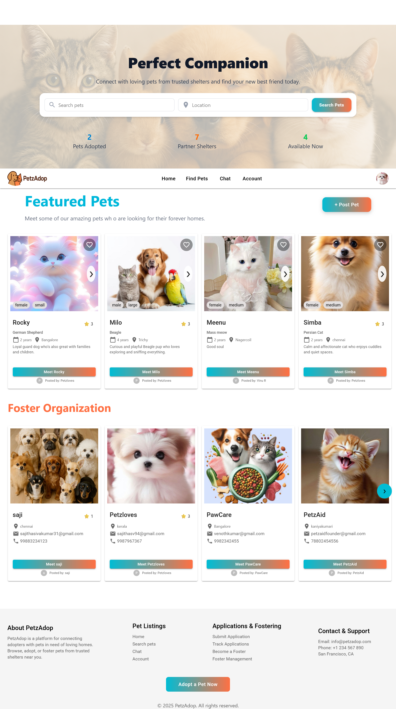
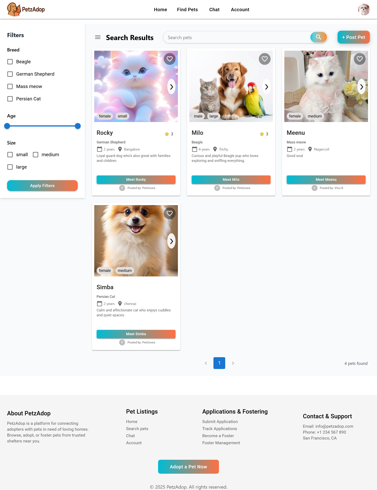
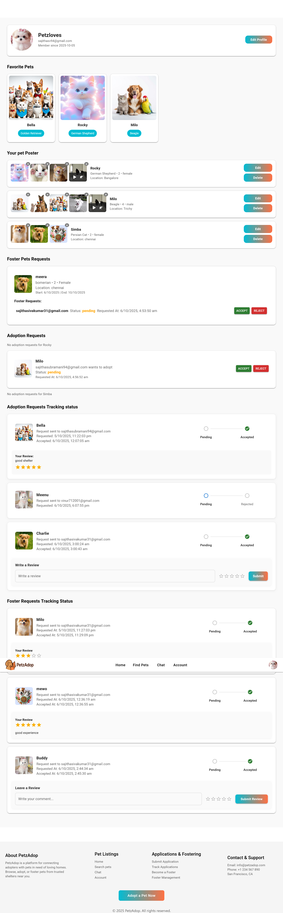
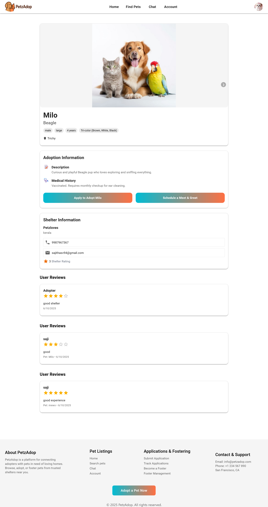

# 🐾 PetzAdop — Pet Adoption Platform

## 🌐 Live Demo

- **Frontend (Netlify):** [https://petzadop-frontend.netlify.app/](https://petzadop-frontend.netlify.app/)
- **Backend (Render):** [https://petzadop-backend.onrender.com](https://petzadop-backend.onrender.com)

## 💻 GitHub Repositories

- **Frontend Repo:** [https://github.com/Sajitha94/petzAdop-Frontend](https://github.com/Sajitha94/petzAdop-Frontend)
- **Backend Repo:** [https://github.com/Sajitha94/petzAdop-Backend](https://github.com/Sajitha94/petzAdop-Backend)

## 🐶 How to Explore

## Login Credentials

### 🧍‍♀️ Adopter User

- **Username:** sajithasv94@gmail.com
- **Password:** saji123

### 🏠 Foster Organization

- **Username:** sajithasivakumar31@gmail.com
- **Password:** saji123

## 🖼️ Preview

### 🏠 Home Page



---

### 🔍 Search Page



---

### 👤 Profile Page



---

### 🐾 Pet Details Page



### 🏠 Home Page

- Displays **adoptable pets** posted by shelters and **foster organizations**.
- Users can browse available pets and view basic details such as breed, age, size, and location.

---

### 🐾 Pet Details Page

- Shows complete **pet information** including description, breed, gender, and location.
- Displays a **review section** where adopters can share feedback.
- Only adopters whose adoption requests are **accepted by the shelter** can submit reviews for adopted pets.

---

### 👤 Profile Page

Includes multiple sections:

- **Favorite List** – Pets you have liked or saved.
- **Your Adopt Pets Posts** – Pets you have listed for adoption.
- **Foster Pets Requests List** – Requests made or received for fostering.
- **Adoption Requests List** – Requests made for pet adoption.
- **Adoption Requests Tracking Status** – Track the progress of your adoption requests.
- **Foster Requests Tracking Status** – Track the progress of your foster requests.

---

### 🌟 Reviews

- **Adoption Reviews:** Adopters whose requests are **approved by the shelter** can post reviews for their adopted pets in the profile page .
- **Foster Reviews:** Foster parents whose requests are **approved by a foster organization** can rate and review their fostering experience in the profile page.

---

### 🔍 Search Page

- Allows users to search pets by **breed**, **age**, **size**, **location**, or **name**.
- Helps quickly find pets that match specific preferences.

---

## 📘 Overview

**PetzAdop** is a full-stack **Pet Adoption Platform** that connects adopters, shelters, and foster parents in one place.  
It allows organizations to **list pets**, adopters to **apply for adoption or fostering**, and both sides to **communicate** and **track application progress**.  
The platform also supports **reviews**, **ratings**, and **search filters** for a smooth and transparent adoption experience.

---

## 🚀 Key Features

### 🐶 Pet Listings

- Organizations can create, update, and delete **detailed pet profiles**.
- Includes **name, age, breed, color, gender, size, and medical history**.
- Upload **photos and videos** for each pet.
- Advanced **search and filter** by breed, size, age, and location.

### 📝 Application Management

- Adopters can **submit adoption applications** directly from pet profiles.
- Organizations can **review, approve, or reject** applications.
- Real-time status updates: `Pending → Accepted → Rejected`.
- Option to **schedule meet & greet** appointments.

### 🌟 User Reviews

- Users can leave **ratings and reviews** for shelters and foster organizations.
- Reviews include **comment**, **rating**, and **review type** (adoption or fostering).
- Displayed with average ratings for transparency.

### 💬 Communication System

- Inbuilt **messaging system** between adopters and organizations.
- Users can chat directly with shelters or foster parents.
- JWT-authenticated chat system for secure communication.

### 🏡 Fostering Pets

- Foster parents can **list their fostered pets**.
- Organizations can **assign pets** to foster homes.
- Manage foster start and end dates, track foster duration.
- Foster parents can **leave feedback** about foster experiences.

### 🔍 Search & Filters

- Search pets by **breed, age, gender, size, and location**.
- Sort by **newest**, **distance**, or **popularity**.
- Quick filters for easy browsing.

### 👤 User Features

- Secure **JWT authentication** for login and signup.
- Users can **edit profiles**, **save favorite pets**, and **track adoption status**.
- Notification and email alert system for application updates.
- Responsive design optimized for **mobile and desktop**.

---

## 📧 Email Verification

> ⚠️ **Note:** Email verification is currently functional **only on localhost**.  
> After deploying the backend (e.g., on Render), email sending **does not work** due to SMTP/environment restrictions.  
> This feature is intended for testing purposes in the local development environment only.
> The issue has been reported on the GUVI platform, but the query is still pending resolution.

---

## 🛠 Installation & Setup

1. **Clone the repositories**

```bash
git clone https://github.com/Sajitha94/petzAdop-Frontend.git
git clone https://github.com/Sajitha94/petzAdop-Backend.git
```
